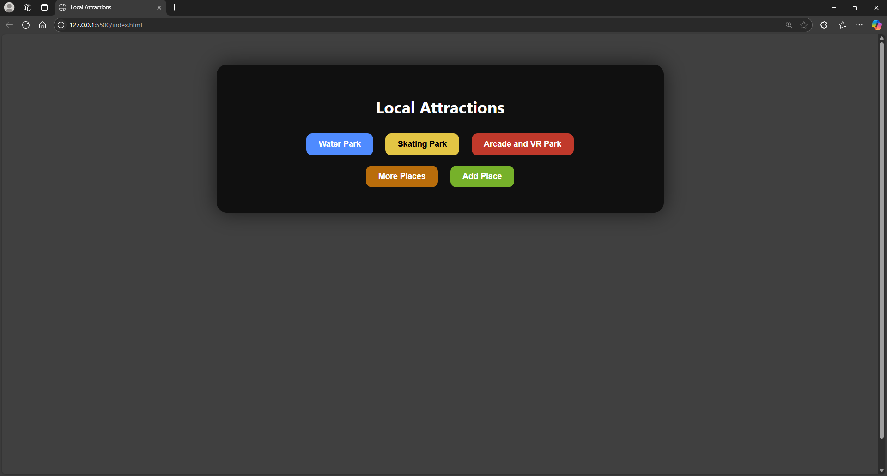

# Local Attractions

This project is a simple web application showcasing local attractions, allowing users to view details about parks, explore more places, and add new attractions.

## Project Structure
Parks/
index.html 
css/ styleAdd.css styleMore.css styles.css 
images/ skate.jpg vr.jpg waterpark.jpg 
js/ script.js 
pages/ add.html more.html

```
Parks/
├── index.html        # Main HTML file
├── css/
│   └── styles.css     # Stylesheet for the app
│   └── styleAdd.css
│   └── styleMore.css
├── images/
│   ├── skate.jpg 
│   ├── vr.jpg  
│   └── waterpark.jpg  
└── js/
    └── script.js     # JavaScript file for dynamic content
```


### File Descriptions

- **index.html**: The main page displaying buttons for different attractions and navigation options.
- **css/styles.css**: Styles for the main page.
- **css/styleMore.css**: Styles for the "More Places" page.
- **css/styleAdd.css**: Styles for the "Add New Place" page.
- **js/script.js**: JavaScript logic for handling user interactions and dynamic content updates.
- **pages/more.html**: A page listing additional local attractions.
- **pages/add.html**: A form page for adding new attractions.
- **images/**: Contains images used as backgrounds for attractions.

## Features

1. **View Attractions**: Click on buttons to view details about specific attractions.
2. **Dynamic Backgrounds**: The background image changes based on the selected attraction.
3. **More Places**: Navigate to a page listing additional attractions.
4. **Add New Place**: Navigate to a form page to add a new attraction.

## How to Run

1. Clone or download the project files.
2. Open `index.html` in a web browser.
3. Interact with the buttons to explore the features.

## Technologies Used

- **HTML**: Structure of the web pages.
- **CSS**: Styling for the pages.
- **JavaScript**: Logic for dynamic interactions.

## Screenshots



## License

This project is for educational purposes and does not include a specific license.
